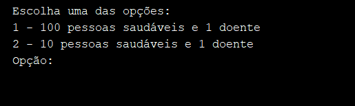
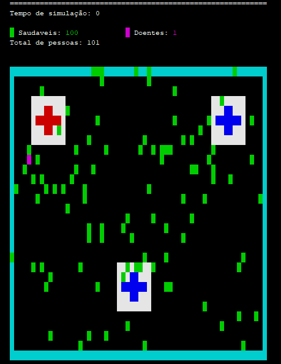
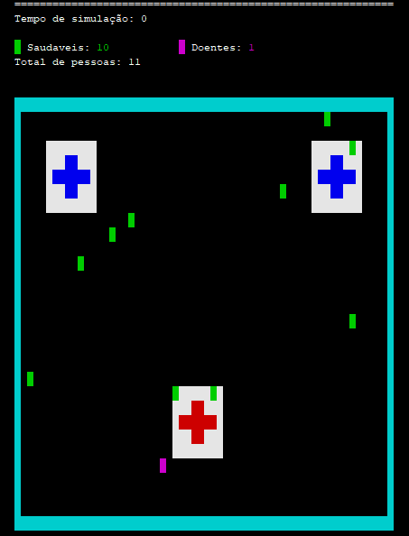

# Covid-19 Simulator
This a Java simulator that shows the spread of Corona virus if people do'nt stay at home

## Description
The simulation runs in console with the use of the [ANSI SCAPE](https://pt.wikipedia.org/wiki/Código_escape_ANSI) for styling

It has two simulations:
* 100 health people and 1 sick people walking around the city
* 10 health people and 1 sick people walking around the city

Both the sick and the healthy have random movements that include: up, down, right and left

In both of them, there are 3 hospitals that cure sick people if they go through it.

Citizens with Covid-19 have 30 seconds to heal, otherwise they die

The simulation ends if all people are healed or if all sick people are dead

## How to Run
Download the [NetBeans IDE](https://netbeans.org/downloads/8.2/rc/?pagelang=pt_BR), open the project and run.

It can work on other ides or even CMD, but has not been tested.

## Simulations

* 100 People

* 10 People

## Examples

Here is a video showing the simulations:
* 100 People

* 10 People
